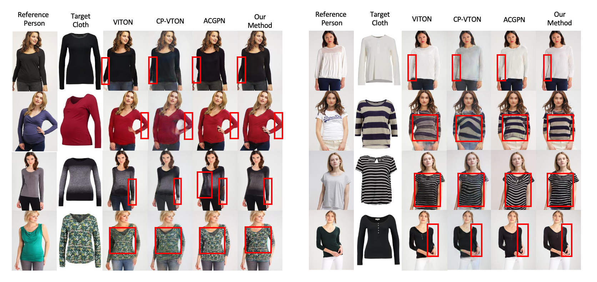

# LM-VTON (AAAI 2021)
The official pytorch implementation of LM-VTON : "Toward Realistic Virtual Try-on Through Landmark-guided Shape Matching"

## Code
1. Download all need data include extra_data.zip, mpv_data.zip, viton_data.zip to the data folder. 
[[Google Drive]](https://drive.google.com/drive/folders/10YIn_-B3ef-7YxdO8NZ2l-o4UM3nkw7b?usp=sharing)

2. Download all checkpoint to the checkpoint folder.
[[Google Drive]](https://drive.google.com/drive/folders/1on11KrKsMd31-6TDTTtV3mKpMhqtDsLr?usp=sharing)

3. Run in first stage.
For example, on mpv dataset, you could refer to first_stage/mpv_scripts/mpv_add_point_vgg_train.sh

4. Run in second stage.
For example, on mpv dataset, you could refer to second_stage/content_fusion_mpv_train.sh

## License
The use of this code is restricted to non-commercial research and educational purposes.
